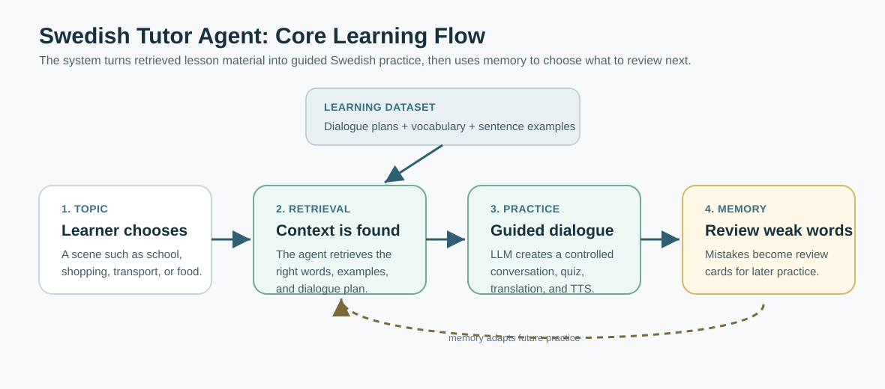

# Assignment 2 Report: Swedish Language Tutor Agent

**Project:** UU Swedish Language Tutor Agent  
**GitHub:** https://github.com/SeanSha/UU-SwedishLanguageTutorAgent  
**Video:** add video link before submission  

## 1. Project Goal

The goal of this project is to build an AI agent that helps beginner learners practise Swedish in controlled everyday scenarios. Instead of using a general chatbot that may generate random or too difficult language, the system grounds each lesson in retrieved teaching material: dialogue plans, vocabulary, and sentence examples. The learner selects a topic, such as food shopping or transport, and the agent retrieves relevant context before generating a structured practice dialogue.

The project is designed around the assignment theme of AI agents and Information Retrieval. The agent performs tool actions for retrieval, memory lookup, quiz generation, answer checking, and text-to-speech. These tools are separated into modules so that the system can be extended later with stronger IR methods or new actions.

## 2. System Design

The application is implemented as a Python Gradio web app. The main interface contains a setup screen, a lesson practice screen, and a memory review quiz. The central class is `SwedishSpeakingAgent` in `agent.py`, which coordinates the tool calls and keeps the dialogue state.

The learning flow is:

1. The user selects a topic label.
2. The structured retrieval tool retrieves a topic-specific dialogue plan, vocabulary list, and sentence examples from local JSONL data.
3. The agent formats the retrieved material as lesson context.
4. The dialogue tool creates a stable turn-by-turn practice flow.
5. The quiz tool generates multiple-choice or fill-in-the-blank exercises.
6. The feedback and memory tools update the learner model after each answer.
7. The TTS tool provides Swedish audio for dialogue sentences and review cards.

The simplified system overview is shown below. I intentionally keep it high-level: the most important idea is the learning loop from topic selection, to retrieval, to guided practice, to memory-based review.

In implementation, the agent is modular: retrieval, dialogue control, quiz generation, feedback, TTS, memory, and LLM connection are separate tools. This keeps the prototype simple to demonstrate but still extensible.

Online mode uses an OpenAI-compatible chat completion client. The code can run with an OpenAI API key through the UI or through `.env` settings. It can also use compatible endpoints such as Berget AI by changing the base URL and model name.

## 3. Information Retrieval Component

The core IR component is the structured retrieval pipeline. The project uses local cached data files:

- `data/dialogue_plans.jsonl`
- `data/vocabulary.jsonl`
- `data/sentence_examples.jsonl`

These local files are based on my Hugging Face dataset:

`SeanSha30/swedish-pre-a1-learning-agent-dataset`  
https://huggingface.co/datasets/SeanSha30/swedish-pre-a1-learning-agent-dataset

For each selected topic, the retrieval tool selects the relevant plan and ranks sentence examples by topic, function, slots, and keyword overlap. This retrieved context is shown in the UI as a lesson guide: first vocabulary, then retrieved sentence examples, then an example dialogue. This makes the retrieval visible to the learner and to the evaluator.

The project also includes a memory-aware retrieval layer. The memory tool stores words the learner got wrong, together with a review weight. Later retrieval and quiz generation can reuse those difficult words, making the system adaptive rather than stateless.

## 4. Memory And Agent Actions

The agent has a simple local memory stored in `memory/user_memory.json` at runtime. This file is ignored by git so personal progress is not uploaded. When a learner answers incorrectly, the relevant word receives a higher review weight. When the learner answers correctly, the weight decays.

This memory is used in two ways:

- It affects practice by prioritising difficult words in retrieval and quiz distractors.
- It powers a separate Memory Review Quiz where the learner reviews weak vocabulary as flashcards.

The memory review page is an important agent action because it turns remembered information into a new task. The agent is not only displaying statistics; it actively creates follow-up practice based on previous learner behaviour.

## 5. Extensibility

The system is intentionally modular. Retrieval, quiz generation, feedback, TTS, memory, and LLM calls are separate tools. This makes the project extendable in several directions:

- Replace keyword ranking with vector search or a database index.
- Add document search for course material or grammar notes.
- Add update actions, such as writing new vocabulary into a learner profile.
- Replace local JSON memory with a more advanced long-term memory store.
- Add more languages or more detailed CEFR-level progression.

This satisfies the requirement that the system should be extendable with IR tools and/or action tools.

## 6. Reflection On AI-Assisted Development

AI coding tools were useful for building and debugging the project, especially when connecting multiple modules and improving the user interface. However, the main challenge was not simply generating code. The difficult part was controlling the dialogue state, making the retrieval results actually influence the lesson, and preventing the UI from becoming confusing.

Through iteration, the system became simpler and more reliable. The final design avoids unnecessary randomness by grounding the lesson in retrieved data. This made the project more suitable as a student assignment: it demonstrates agent architecture, memory, and IR clearly without pretending to be a full commercial product.

The main lesson from using AI tools is that they are powerful for implementation, but the developer still needs to inspect, test, and simplify the design. In this project, AI assistance helped accelerate development, while manual testing and design decisions were necessary to make the agent understandable and stable.

## 7. Submission Checklist

- GitHub repository: https://github.com/SeanSha/UU-SwedishLanguageTutorAgent
- Runnable with OpenAI-compatible API key
- Modular IR and tool-based agent design
- Memory and review action implemented
- Video demonstration: add link before submission
